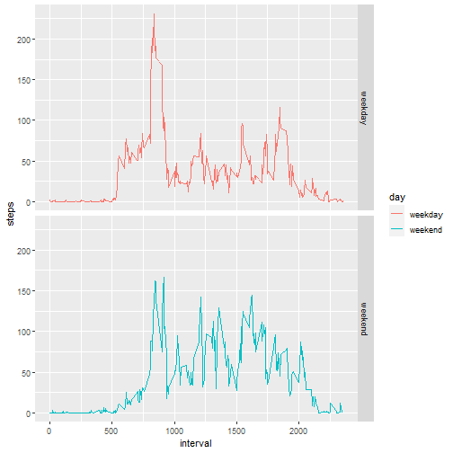

### Introduction
It is now possible to collect a large amount of data about personal movement 
using activity monitoring devices such as a Fitbit, Nike Fuelband, or Jawbone 
Up. These type of devices are part of the “quantified self” movement – a group 
of enthusiasts who take measurements about themselves regularly to improve their 
health, to find patterns in their behavior, or because they are tech geeks. But 
these data remain under-utilized both because the raw data are hard to obtain 
and there is a lack of statistical methods and software for processing and 
interpreting the data.

This assignment makes use of data from a personal activity monitoring device. 
This device collects data at 5 minute intervals through out the day. The data 
consists of two months of data from an anonymous individual collected during 
the months of October and November, 2012 and include the number of steps taken 
in 5 minute intervals each day.

The data for this assignment can be downloaded from the course web site:

Dataset: [Activity monitoring data][1] 

[1]: https://d396qusza40orc.cloudfront.net/repdata%2Fdata%2Factivity.zip 
"Activity monitoring data"

The variables included in this dataset are:

- **steps**: Number of steps taking in a 5-minute interval (missing values are 
coded as NA)

- **date**: The date on which the measurement was taken in YYYY-MM-DD format

- **interval**: Identifier for the 5-minute interval in which measurement was 
taken

The dataset is stored in a comma-separated-value (CSV) file and there are a 
total of 17,568 observations in this dataset.

**Assignment**

This assignment will be described in multiple parts. You will need to write a 
report that answers the questions detailed below. Ultimately, you will need to 
complete the entire assignment in a single R markdown document that can be 
processed by knitr and be transformed into an HTML file.


### Loading and pre-processing the data
Show any code that is needed to:

**1. Load the data (i.e. read.csv())**

First we download and unzip the data if we have not done it previously. 

```r
url = "https://d396qusza40orc.cloudfront.net/repdata%2Fdata%2Factivity.zip"
zip_file = "repdata_data_activity.zip"
if(!file.exists(zip_file)) download.file(url = url, destfile = zip_file)

file_name = "activity.csv"
if(!file.exists(file_name)) unzip(zipfile = zip_file)
```

Now we read the data. 

```r
df <- read.csv(file_name)
```
Then let's look at the head of the data frame. 

```r
head(df, 10)
```

```
##    steps       date interval
## 1     NA 2012-10-01        0
## 2     NA 2012-10-01        5
## 3     NA 2012-10-01       10
## 4     NA 2012-10-01       15
## 5     NA 2012-10-01       20
## 6     NA 2012-10-01       25
## 7     NA 2012-10-01       30
## 8     NA 2012-10-01       35
## 9     NA 2012-10-01       40
## 10    NA 2012-10-01       45
```

And also the tail of the data frame.

```r
tail(df, 10)
```

```
##       steps       date interval
## 17559    NA 2012-11-30     2310
## 17560    NA 2012-11-30     2315
## 17561    NA 2012-11-30     2320
## 17562    NA 2012-11-30     2325
## 17563    NA 2012-11-30     2330
## 17564    NA 2012-11-30     2335
## 17565    NA 2012-11-30     2340
## 17566    NA 2012-11-30     2345
## 17567    NA 2012-11-30     2350
## 17568    NA 2012-11-30     2355
```

**2. Process/transform the data (if necessary) into a format suitable for your 
analysis.** 

Now let's look at the summary of the dataframe. 

```r
str(df)
```

```
## 'data.frame':	17568 obs. of  3 variables:
##  $ steps   : int  NA NA NA NA NA NA NA NA NA NA ...
##  $ date    : chr  "2012-10-01" "2012-10-01" "2012-10-01" "2012-10-01" ...
##  $ interval: int  0 5 10 15 20 25 30 35 40 45 ...
```

As you see the date is of type character so we need to convert it to type Date. 

```r
df$date <- as.Date(df$date)
str(df)
```

```
## 'data.frame':	17568 obs. of  3 variables:
##  $ steps   : int  NA NA NA NA NA NA NA NA NA NA ...
##  $ date    : Date, format: "2012-10-01" "2012-10-01" "2012-10-01" "2012-10-01" ...
##  $ interval: int  0 5 10 15 20 25 30 35 40 45 ...
```


### What is mean total number of steps taken per day?
For this part of the assignment, you can ignore the missing values in the dataset.

**1. Calculate the total number of steps taken per day**

```r
total_daily_steps <- aggregate(steps ~ date, data = df, FUN = sum, na.rm = TRUE)
```

**2. Make a histogram of the total number of steps taken each day**

```r
hist(total_daily_steps$steps, col="blue",
     xlab = "Total Steps per Day", main = "Total Number of Steps per Day")
```


**3. Calculate and report the mean and median of the total number of steps 
taken per day**


```r
print(paste("Mean number of steps taken per day:", 
            mean(total_daily_steps$steps)))
```

```
## [1] "Mean number of steps taken per day: 10766.1886792453"
```

```r
print(paste("Median number of steps taken per day", 
            median(total_daily_steps$steps)))
```

```
## [1] "Median number of steps taken per day 10765"
```


### What is the average daily activity pattern?

**1. Make a time series plot (i.e. type = "l" ) of the 5-minute interval 
(x-axis) and the average number of steps taken, averaged across all days 
(y-axis)**


```r
ave_interval_steps <- aggregate(steps ~ interval, data = df, FUN = mean, 
                                na.rm=TRUE)

plot(steps ~ interval, data = ave_interval_steps, type="l", col="blue",
     xlab="5-minute Intervals", ylab = "Average Steps")
```


**2. Which 5-minute interval, on average across all the days in the dataset, 
contains the maximum number of steps?**


```r
max_interval <- ave_interval_steps$interval[which.max(ave_interval_steps$steps)]
```
The 5-minute interval contains the maximum number of steps is 
**835**.


### Imputing missing values
Note that there are a number of days/intervals where there are missing values 
(coded as NA). The presence of missing days may introduce bias into some 
calculations or summaries of the data.

**1. Calculate and report the total number of missing values in the 
dataset (i.e. the total number of rows with NAs)**


```r
colSums(is.na(df))
```

```
##    steps     date interval 
##     2304        0        0
```

```r
barplot(colSums(is.na(df)), ylim = c(0, 2500), 
        xlab = "Data Variables", ylab = "Number of Missing Values")
```


**2. Devise a strategy for filling in all of the missing values in the dataset.
The strategy does not need to be sophisticated. For example, you could use the 
mean/median for that day, or the mean for that 5-minute interval, etc.** 

Here we use the mean for the 5-minute interval to fill out missing values. 

```r
ave_interval_steps <- aggregate(steps ~ interval, data = df, FUN = mean, 
                                na.rm=TRUE)
```

**3. Create a new dataset that is equal to the original dataset but with the 
missing data filled in.**


```r
fill_na_df <- df
fill_na_df$steps[is.na(fill_na_df$steps)] <- ave_interval_steps[, 2]
```

**4. Make a histogram of the total number of steps taken each day.**

```r
total_daily_steps2 <- aggregate(steps ~ date, data = fill_na_df, FUN = sum)

par(mfrow = c(1, 2))

hist(total_daily_steps$steps, col="blue",
     xlab = "Total steps per day",
     main = "Total Steps per Day (w NAs)")

hist(total_daily_steps2$steps, 
     xlab = "Total steps per day", col="green",
     main = "Total Steps per Day (w/o NAs)")
```


**Calculate and report the mean and median total number of steps taken per 
day. Do these values differ from the estimates from the first part of the 
assignment?**


```r
mean1 <- as.integer(mean(total_daily_steps$steps))
mean2 <- as.integer(mean(total_daily_steps2$steps))
```

The mean of the original data containing missing value is **10766**. 
And the mean of the data after filling the missing value is **10766**.


```r
median1 <- as.integer(median(total_daily_steps$steps))
median2 <- as.integer(median(total_daily_steps2$steps))
```
The median of the original data containing missing value is **10765**. 
And the median of the data after filling the missing value is **10766**.

So clearly there is not a big difference between the mean and median of the 
original data and the data with filled missing values. 

**What is the impact of imputing missing data on the estimates of the total 
daily number of steps?**


```r
summary(total_daily_steps)
```

```
##       date                steps      
##  Min.   :2012-10-02   Min.   :   41  
##  1st Qu.:2012-10-16   1st Qu.: 8841  
##  Median :2012-10-29   Median :10765  
##  Mean   :2012-10-30   Mean   :10766  
##  3rd Qu.:2012-11-16   3rd Qu.:13294  
##  Max.   :2012-11-29   Max.   :21194
```

```r
summary(total_daily_steps2)
```

```
##       date                steps      
##  Min.   :2012-10-01   Min.   :   41  
##  1st Qu.:2012-10-16   1st Qu.: 9819  
##  Median :2012-10-31   Median :10766  
##  Mean   :2012-10-31   Mean   :10766  
##  3rd Qu.:2012-11-15   3rd Qu.:12811  
##  Max.   :2012-11-30   Max.   :21194
```

```r
par(mfrow = c(1, 2))
boxplot(total_daily_steps$steps, col="blue", 
        main="Step Variable w NAs", xlab="Step Variable")

boxplot(total_daily_steps2$steps, col="green", 
        main="Step Variable w/o NAs", xlab="Step Variable")
```


As we see in the above picture there is not a big difference in the 
distribution of *step* variable with missing values and 
once the missing values are filled.


### Are there differences in activity patterns between weekdays and weekends?
For this part the weekdays() function may be of some help here. Use the dataset 
with the filled-in missing values for this part.

**1. Create a new factor variable in the dataset with two levels – “weekday” 
and “weekend” indicating whether a given date is a weekday or weekend day.**


```r
fill_na_df$day <- as.factor(ifelse(weekdays(fill_na_df$date)=="Saturday" |  
                                        weekdays(fill_na_df$date)=="Sunday", 
                                        "weekend", "weekday"))
```

**Make a panel plot containing a time series plot of the 5-minute interval 
(x-axis) and the average number of steps taken, averaged across all weekday 
days or weekend days (y-axis).** 


```r
library(ggplot2)
temp <- aggregate(steps ~ interval + day, data = fill_na_df, FUN = mean)
ggplot(temp, aes(interval, steps, color=day)) + geom_line() + facet_grid(day~.)
```



**Reference**: 
https://github.com/rdpeng/RepData_PeerAssessment1


